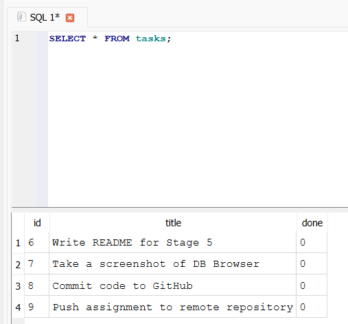

# FlyRank Backend Internship: Task API (SQLite Integration)

This is a RESTful API for managing tasks, built with Express.js. In this week's iteration, the storage layer has been upgraded from in-memory arrays to a persistent SQLite database.

## How to Run the Project

To run this project from a clean clone, execute the following commands in your terminal:

```bash
npm install
node index.js
The server will start on http://localhost:3000.
```

## Database Architecture
Why SQLite was chosen: SQLite was chosen because it operates as a single file, requires zero separate server setup, and ensures that data survives server restarts.

Where the database lives: The data is stored locally in a file named tasks.db. This file is created automatically the first time the application runs. It is explicitly added to .gitignore so that anyone cloning the repository starts with a fresh database, and the initial seed script will automatically populate it with three starter tasks.

## SQL Exploration
During development, I interacted with the database directly using DB Browser for SQLite.

One of the queries I ran manually was:

``` bash
SELECT COUNT(*) FROM tasks;
```
Result: This query returned the total integer count of all rows currently existing in the tasks table, proving that the database was accurately tracking the API's input. 


## Database Proof
Below is a screenshot of the tasks.db file opened in DB Browser, displaying the table structure and current rows:

