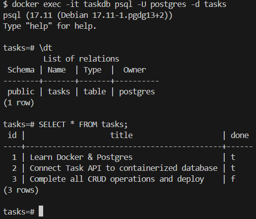

# Containerized Task API

**What this is:** A RESTful API for managing tasks, built with Node.js, Express, and PostgreSQL. The entire application and database are containerized using Docker Compose, including automatic database initialization and seeding.

## How to Run
Clone the repository, set up your environment variables, and start the stack with one command:

1. `cp .env.example .env`
2. `docker compose up`

## Environment Variables
Check the `.env.example` file for the required variables. 
* `DATABASE_URL` (points to the internal Docker db service)
* `PORT` (default is 3000)

## Endpoints
| Method | Endpoint | Description |
|--------|----------|-------------|
| GET    | `/`      | API root and metadata |
| GET    | `/health`| Server health check |
| GET    | `/docs`  | Swagger OpenAPI Documentation |
| GET    | `/tasks` | Retrieve all tasks |
| GET    | `/tasks/:id` | Retrieve a single task |
| POST   | `/tasks` | Create a new task |
| PUT    | `/tasks/:id` | Update an existing task |
| DELETE | `/tasks/:id` | Delete a task |

## Example Request
`curl -i http://localhost:3000/tasks`

HTTP/1.1 200 OK
X-Powered-By: Express
Content-Type: application/json; charset=utf-8
Content-Length: 180
Date: Mon, 31 Aug 2026 12:00:00 GMT
Connection: keep-alive
Keep-Alive: timeout=5

[
  {"id":1,"title":"Learn Docker & Postgres","done":true},
  {"id":2,"title":"Connect Task API to containerized database","done":true},
  {"id":3,"title":"Complete all CRUD operations and deploy","done":false}
]

## Database Proof
